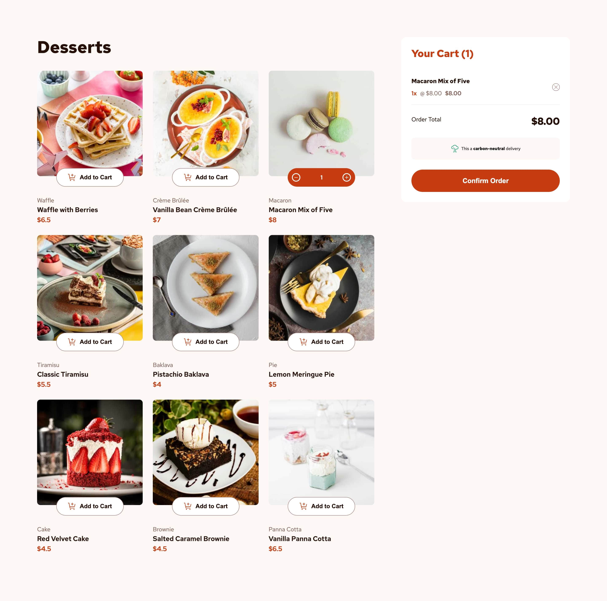

# Frontend Mentor - Product list with cart solution

This is a solution to the [Product list with cart challenge on Frontend Mentor](https://www.frontendmentor.io/challenges/product-list-with-cart-5MmqLVAp_d). Frontend Mentor challenges help you improve your coding skills by building realistic projects.

## Table of contents

- [Overview](#overview)
  - [The challenge](#the-challenge)
  - [Screenshot](#screenshot)
  - [Links](#links)
- [My process](#my-process)
  - [Built with](#built-with)
  - [What I learned](#what-i-learned)
  - [Continued development](#continued-development)
  - [Useful resources](#useful-resources)
- [Author](#author)

**Note: Delete this note and update the table of contents based on what sections you keep.**

## Overview

### The challenge

Users should be able to:

- Add items to the cart and remove them
- Increase/decrease the number of items in the cart
- See an order confirmation modal when they click "Confirm Order"
- Reset their selections when they click "Start New Order"
- View the optimal layout for the interface depending on their device's screen size
- See hover and focus states for all interactive elements on the page

### Screenshot



### Links

- Solution URL: [GitHub repository](https://github.com/raulgaliciab/product-list-cart)
- Live Site URL: [Vercel](https://products-cart-gamma.vercel.app/)

## My process

### Built with

- [Vite](https://vite.dev/)
- [React](https://reactjs.org/)
- [Context API](https://react.dev/reference/react/createContext)
- [Animate.css](https://animate.style/)
- CSS Flexbox and Grid

### What I learned

- **Context API:** How to add and handle one or more global contexts on React with the Context API; including createContext, useContext and useReducer.

```
  // Create Context
  export const CartContext = createContext();

  // Provider

  export const CartProvider = ({ children }) => { ... };

  return (
    <CartContext.Provider value={{ cartState, increaseItem, decreaseItem, removeItem, clearCart }}>
      { children }
    </CartContext.Provider>
  );
```

- **Conditional render:** How to mount and unmount components with conditional render tools like ternaries and logical operators like &&.

```

  // Cart Context
  const { cartState } = useContext(CartContext);

  // Item quantity in Cart
  const cartItem = cartState.find( (element) => element.id === item.id );
  const itemQuantity = (cartItem) ? cartItem.quantity : 0;

  // Conditional Button Render
  {
    ( itemQuantity >= 1 )
      ? <CounterButton item={ item } />
      : <AddToCart item={ item }/>
  }
```

- **Vercel deploy:** How to properly deploy a more complex project on Vercel and what thing in the project could work on local and fail on deploy; such as imports and folder structure.

### Continued development

- Config files such as vite.config.js
- Folders structure
- Vercel deployment

### Useful resources

- [Picture element](https://developer.mozilla.org/en-US/docs/Web/HTML/Element/picture) - Used to optimize images with media queries just using a HTML tag

## Author

- Raúl Galicia
- Frontend Mentor - [@raulgaliciab](https://www.frontendmentor.io/profile/raulgaliciab)
